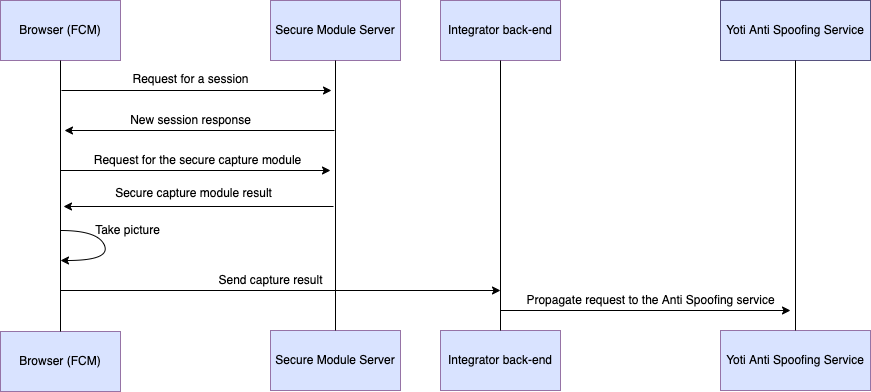

# web-fcm-demo

Welcome to the Web FCM Demo. The purpose of this repository is to demo the Face Capture Module npm package integration and use the output image to perform a prediction calling Yoti AI Services.

## Setup

This project needs to have a configuration file in order to work. We only need to pass the configuration values as environment variables. We can follow this approach using a `.env.local` file:

Rename `.env.example` to `.env.local` and fill in the configuration values:

```bash
PEM_FILE_PATH=
SDK_ID=
ENDPOINT=
```

- **PEM_FILE_PATH:** path to the `.pem` private key needed to request Yoti Services.
- **SDK_ID:** client SDK ID needed to request Yoti Services.
- **ENDPOINT:** endpoint for the service to be requested.

Both `PEM_FILE_PATH` and `SDK_ID` secrets are obtained from following the instructions in [this document](https://developers.yoti.com/yoti/getting-started-hub). Specifically, under `Generate API keys` section.

The information required to fill the `ENDPOINT` variable can be found [here](https://developers.yoti.com/age-estimation/integration-guide). The `BASE_URL` (base URL for the service to be requested) is set in the `.env` file (check the value to fill the `ENDPOINT` field).

## Run locally

This demo was designed to be run locally. To get started, follow the below steps in the root directory:

1. Install all the dependencies:

    ```bash
    npm install
    ```

2. Start the server that will manage the request:

    ```bash
    node server.js
    ```

3. Start the client in a different terminal window:

    ```bash
    npm start
    ```

Now the client is ready to use. You just need to follow the FCM instructions, take a photo and wait for the response.

### Windows

If the client browser does not start automatically or the given address in the terminal does not work, replace `0.0.0.0` by `127.0.0.1`.

## Face Capture module

The `Face Capture` module is a npm package that provides a React component which takes pictures using face detection tools.
The usage of this module can be found in `App.js`. You can find more information about how to install the dependency, the API sections, etc [here](https://www.npmjs.com/package/@getyoti/react-face-capture).

Use the secure flag to ensure the image can't be changed once is taken. Have in mind this will make some additional calls to the Yoti servers in order to secure the request.

### Secure mode

The secure mode allows [Yoti back-end
service](https://developers.yoti.com/age-estimation/integration-guide)
verifying the image captured on the client-side browser with the FCM hasn't been
modified in any form. Note the Secure mode of Yoti FCM will request Yoti
back-end in order to download the encrypted capture package that takes the
photos and create the secure result request. The secure result information will
be returned in `onSuccess` callback:

```json
{
  "img": "<base64_img>",
  "secure": {
    "version": "<fcm_version>",
    "token": "<session_token>",
    "signature": "<result_signature>"
  }
}
```

The flow for the secure mode is the following:

1. Request for a session -> `(GET) https://api.yoti.com/ai/sm/v1/secure-fcm/<version>/token`
2. Request for the encrypted javascript module -> `(GET) https://api.yoti.com/ai/sm/v1/secure-fcm/<version>/module?s=<token>`

Where `<version>` is the current version of the FCM (It is embedded in the
module) and the `<token>` is the session token the first request returns.



## Yoti NodeJS SDK

The `Yoti NodeJS SDK` package allows to integrate a NodeJS back-end with Yoti apps. The usage of this package to perform predictions to a Yoti app can be found in `server.js` file. For more information about this package, check [this link](https://www.npmjs.com/package/yoti).

Level of assurance is an optional parameter of the Yoti antispoofing API used to determine the strictness of the check.
