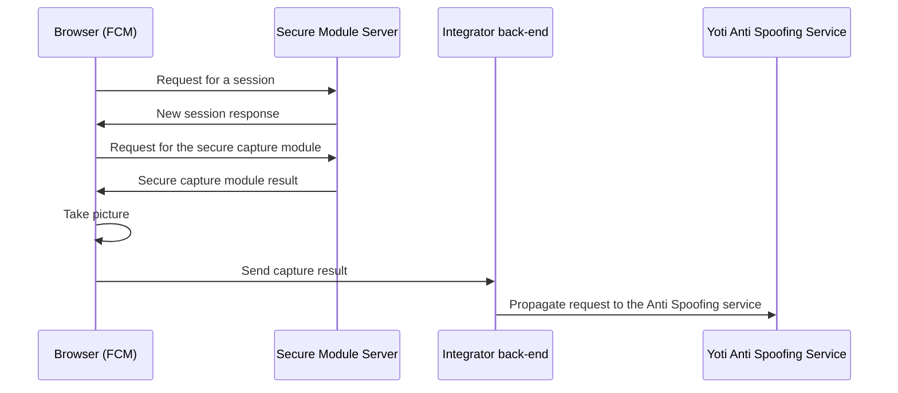

# Secure mode

The secure mode allows [Yoti back-end
service](https://developers.yoti.com/age-estimation/integration-guide)
verifying the image captured on the client-side browser with the FCM hasn't been
modified in any form. Note the Secure mode of Yoti FCM will request Yoti
back-end in order to download the encrypted capture package that takes the
photos and create the secure result request. The secure result information will
be returned in `onSuccess` callback:

```json
{
  "img": "<base64_img>",
  "secure": {
    "version": "<fcm_version>",
    "token": "<session_token>",
    "signature": "<result_signature>"
  }
}
```

The flow for the secure mode is the following:

1. Request for a session -> `(GET) https://api.yoti.com/ai/sm/v1/secure-fcm/<version>/token`
2. Request for the encrypted javascript module -> `(GET) https://api.yoti.com/ai/sm/v1/secure-fcm/<version>/module?s=<token>`

Where `<version>` is the current version of the FCM (It is embedded in the
module) and the `<token>` is the session token the first request returns.


